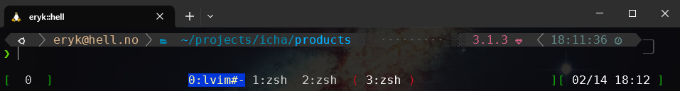

```text
 _ _ _ _____ __       _____                      _____
| | | |   __|  |     |  _  |___ _ _ _ ___ ___   |   __|___ _ _ 
| | | |__   |  |__   |   __| . | | | | -_|  _|  |   __|   | | |
|_____|_____|_____|  |__|  |___|_____|___|_|    |_____|_|_|\_/ 
```


# Introduction

Repository containing bunch of automation scripts (mostly Ansible tasks) to install, configure and maintain Windows WSL2 environment based on Ubuntu 20.04, including set of very useful dev tools and customizations to ease out and speed up terminal usage during day-to-day work and bump up productivity.

# Concept

The idea is to have something consistent when trying to configure new Windows machine with WSL2 for automation development purposes (like DevOps/SysAdmin thingy). Also, it should be able to run it repeatably to also update installed tools and customizations to latest versions. Last, but not least, it should be easily extendable and configurable to suit personal needs.

# Notice

Below project is an opinionated set of tools which I use for my everyday work, but I hope someone will find it useful after tailoring it to ones needs. Please read below README carefully and go through the scripts to see whats going on there before using on existing Windows/WSL. All the tools/customizations I use will be listed, described and if there are any customizations they will be shown. If you clone this repository and have some new ideas/functionalities/fixes, feel free to create a Pull Request, it will be very much appreciated!

# TODO

- finish usage descriptions with videos and images
- add [SDKMan](https://sdkman.io) installation (with Groovy/Gradle?) or:
- use [ASDF](https://github.com/asdf-vm/asdf) version manager instead of RVM/NVM/SDKman etc.

# Table of contents

- [Introduction](#introduction)
- [Concept](#concept)
- [Notice](#notice)
- [TODO](#todo)
- [Table of contents](#table-of-contents)
- [Requirements](#requirements)
  - [Windows setup](#windows-setup)
    - [Manual](#manual)
    - [Automated](#automated)
      - [prepare-windows.ps1](#prepare-windowsps1)
      - [prepare-wsl.sh](#prepare-wslsh)
      - [setup-windows.yml](#setup-windowsyml)
  - [WSL2 setup](#wsl2-setup)
  - [Roles overview](#roles-overview)
    - [`software` role](#software-role)
    - [`config` role](#config-role)
    - [`dev` role](#dev-role)
  - [Usages](#usages)
    - [Terminal](#terminal)
      - [Tmux](#tmux)
    - [Git](#git)
    - [Neovim with LunarVIM](#neovim-with-lunarvim)
    - [Helm](#helm)
    - [Languages](#languages)
      - [Ruby](#ruby)
      - [Node](#node)
      - [Puppet](#puppet)
      - [Ansible](#ansible)
      - [Rust](#rust)
- [Author](#author)
- [Mentions](#mentions)

# Requirements

- (obviously) Windows 10 version 2004 and higher (Build 19041 and higher) or Windows 11
- WSL2 configured
- Ubuntu 20.04 installed
- Any terminal using any iconic font (like [Nerd Fonts](https://www.nerdfonts.com/) - see windows setup for details)

If you have all that, you can skip to [WSL2 setup](#wsl2-setup).

## Windows setup

Windows setup should be done manually, however there is an experimental automation for that (see [Automated](#automated) section)

### Manual

1. Install WSL, if not already installed - from Powershell (Administrator):

    ```shell
    wsl.exe --install -d 'Ubuntu-20.04'
    wsl.exe --set-default 'Ubuntu-20.04'
    ```

    For details, see [Microsoft WSL installation docs](https://docs.microsoft.com/en-us/windows/wsl/install)

2. Install DejaVuSans fonts (it can be found in this repo in `ansible/roles/windows/files/fonts`)
3. Install [Microsoft Terminal](https://github.com/microsoft/terminal) and configure Ubuntu profile with DejaVuSans font. You can check `ansible/roles/windows/templates/settings.json.j2` for settings reference with useful overrides.

Points #2 and #3 are optional (I use them personally) - you can use any terminal of your choice and any font supporting iconic fonts (like [Nerd Fonts](https://www.nerdfonts.com/) - please note that not all fonts have the same amount of glyphs/icons. DejaVu has lots of them)

Thats it, you can move to [WSL2 setup](#wsl2-setup)

### Automated

There is an initial automation for setting up Windows, which includes the steps above and some more things, like installing software I commonly use.

#### prepare-windows.ps1

There is a script `prepare-windows.ps1`, which will:

- Install WSL with Ubuntu 20.04
- Enable WinRM protocol with CredSSP authentication transport (to be able to run Ansible from WSL2 to configure Windows)
- Install [Chocolatey](https://chocolatey.org/) package manager to install software

#### prepare-wsl.sh

After `prepare-windows.ps1` is run, login to Ubuntu WSL and clone this repository.

From Ubuntu, run `sudo ./prepare-wsl.sh` - this will update the system and install required ansible packages.

#### setup-windows.yml

1. Modify `ansible/roles/vars/environment.yml` and set `win_username` to your windows User
2. Investigate `ansible/roles/windows/tasks/main.yml` and review all other tasks in that directory to see what would be done
    1. `common.yml` will install common software packages, like 7Zip, Firefox, BitWarden etc.
    2. `dev.yml` will install GIT, Windows Terminal, IntelliJ, VSCode, Docker Desktop, Postman
    3. `context_menu.yml` will clean up context menu from things added by some of the packages above
    4. `terminal.yml` will install MesloLGS fonts and apply custom settings for Windows Terminal
    5. `entertainment.yml` will install additional software, like Spotify, VLC, Discord etc.

You can switch off the whole sections from #2 by modifying `ansible/roles/windows/vars/main.yml`. For customization, just edit the yaml files.

After everything is prepared, you can run (from `ansible/` dir):

```shell
ansible-playbook -i inventory.yml setup-windows.yaml -k
```

It will prompt for you Windows password. If the terminal hangs during an execution for more than couple minutes, just break it (CTRL+C) and run again. This is because Chocolatey installations from WSL ansible can get clogged up sometimes (not sure why this happens).

## WSL2 setup

Now for the main part :). Assuming all the [requirements](#requirements) are met (Windows manual or automatic setup covered):

1. Clone this repository in WSL Ubuntu if not yet already.
2. Run `sudo ./prepare-wsl.sh` (if not already run during windows setup) to update the system and install required ansible packages.
3. Run ansible (from `ansible/` dir):

    ```shell
    ansible-playbook -i inventory.yml setup-wsl.yaml -K
    ```

You might want to go through [very basic config](#roles-overview) before running the installation. This will install everything - see [usages](#usages) for details. Most of the software packages are installed directly from Github repositories and are placed in `${HOME}/.local/` directory, however others are installed either from PIP, direct links or other things.

## Roles overview

All of the roles have their main configuration in `ansible/roles/<role>/vars/main.yml`. Also, their tasks are gathered in `ansible/roles/<role>/tasks/main.yml`. It is good idea to take a peek on all the .yml files in `tasks/` directories also. For detailed description of how do those things work together, see [Usages](#usages) section below.

### `software` role

This role will install all necessary things to have the WSL pretty and useful.

1. ZSH shell based on [Oh-my-ZSH](https://github.com/ohmyzsh/ohmyzsh) framework, with [powerlevel10k](https://github.com/romkatv/powerlevel10k) theme, and some custom plugins.
2. [LS with GIT status](https://github.com/gerph/ls-with-git-status) - list files/directories with GIT info
3. [FZF Fuzzy finder](https://github.com/junegunn/fzf) - insane speed fuzzy finder with milion usage scenarios
4. [Diff-so-fancy](https://github.com/so-fancy/diff-so-fancy) - alternate GIT DIFF presentation
5. [Git fuzzy](https://github.com/bigH/git-fuzzy.git) - managing GIT commands using FZF
6. [Gita](https://github.com/nosarthur/gita) - managing multiple GIT repositories at once (add groups, execute git or shell commands for those groups etc.)
6. [TheFuck](https://github.com/nvbn/thefuck) - corrects errors in previous console commands
7. [BAT](https://github.com/sharkdp/bat) - (much) better CAT
8. [Zoxide](https://github.com/ajeetdsouza/zoxide) - traverse directories with ease (also with FZF)
9. [Helm](https://github.com/helm/helm) - Kubernetes 'package manager'
10. [Ripgrep](https://github.com/BurntSushi/ripgrep) - `grep` on steroids. Blazing fast, easy to use
11. [fd](https://github.com/sharkdp/fd) - `find` alternative, much faster
12. [htop](https://htop.dev/) - process viewer, prettier `top` alternative

Also, common useful packages, like:

- tmux (terminal multiplexer)
- mlocate (file search)
- tree (directory tree)
- jq (json/yaml parser)

More useful packages will be installed in `dev` role.

In `roles/software/vars/main.yml` file, you can configure for example:

- particular versions of software in `versions` key - by default they are set to `latest`, so that they will get updated when re-running the `setup-wsl.yml` playbook
- list of packages that will get installed from apt repository (like git, tmux, tree, htop etc.)
- Oh-My-ZSH plugin list

### `config` role

This role is mostly `dotfiles` management. It will apply configuration for:

- ZSH/powerlevel10k theme (`.zshrc` / `.p10k.zsh`)
- Tmux (`.tmux.conf`)
- GIT config (`.gitconfig`)

If you already have any of those files, you can either turn off overwrites, or back them up before overwriting, by setting appropriate option in `roles/config/vars/main.yml`:

- `dotfiles_overwrite` (default: true)
- `dotfiles_backup` (default: false)

You can also granulize this on per-component basis - see mentioned `vars/main.yml`.

### `dev` role

This role installs programming-related tools which I currently use in my work.

Essential:
 - [Neovim](https://github.com/neovim/neovim) - more handsome VIM brother
 - [LunarVIM](https://github.com/LunarVim/LunarVim) - Neovim IDE-like extension with awesome plugins/configurations included out of the box

Programming:
- [RVM](https://rvm.io/) (Ruby enVironment Manager, installed using [rvm1-ansible-role](https://github.com/rvm/rvm1-ansible)), along with Rubies: 2.4.10, 2.7.6 and 3.1.2
- [PDK](https://puppet.com/try-puppet/puppet-development-kit/) (Puppet Development Kit)
- [NVM](https://github.com/nvm-sh/nvm) (Node Version Manager) with latest LTS Node version (by default). Among all - dependency for LunarVIM installation

In `roles/dev/vars/main.yml` you can specify Neovim/LunarVIM and RVM/PDK/NVM versions.

## Usages

Below you can find some useful commands/shortcuts/tips on how to use all of this fancy software. For more details, see the [software role](#software-role) section and take a look at the links there. Below you will find most common scenarios I use and custom added things (configs, modifications, functions).

### Terminal

Terminal is ZSH-based, configured with [Oh-my-ZSH](https://github.com/ohmyzsh/ohmyzsh) framework, with [powerlevel10k](https://github.com/romkatv/powerlevel10k):
<details>
  <summary>Click to expand!</summary>
  
</details>

There are couple of useful plugins installed there (you can find them in `roles/config/files/.zshrc`), like:

- syntax highlighting
- commands autocompletion (based on history and/or completion scripts)
- [`FZF`](https://github.com/junegunn/fzf) integration (fuzzy search command history with `CTRL+r` and lots other places - try using TAB or `**TAB` here and there)
    - TODO: video
- Fuzzy search/go to directory with `ALT+c`
- traversing directories back and forth (and parent/child) with `ALT+<left|right|up|down>`
- aliases autosuggestions - tells you that you have an alias for particular commands
    - TODO: example
- easily traversing through visited directories (using [`zoxide`](https://github.com/ajeetdsouza/zoxide))
    <details>
    <summary>Click to expand!</summary>
    
    </details>
- correct your commands with `fuck` or `ESC ESC`
    - TODO: video
- finding files with FZF using custom `bfind` alias - with preview and all
    - TODO: image
- prettier cat (with [`bat`](https://github.com/sharkdp/bat)) with syntax highlight and all

#### Tmux

For TMUX overall usage, please see its documentation with `man tmux`.

Basic usage:

- start with `tmux new`
- `<C-b>c` - new window
- `<C-b>%` - split window vertically
- `<C-b>"` - split window horizontally
- `<C-b><arrows>` - move between panes
- `<C-b>xy` - kill pane
- `<C-b>n` - next window
- `<C-b>l` - last window
- `<C-b>p` - previous window (in order)

Custom modifications in `roles/config/files/.tmux.conf` include:

- colorscheme
- session management (`<C-b><C-s>` to save session, `<C-b><C-r>` to restore)
- enabled mouse support
- prevent deselect+auto scroll on mouse selection copy (very annoying..)

### Git

For smooth GIT experience there are some tools configured:

- [diff-so-fancy](https://github.com/so-fancy/diff-so-fancy) - better looking diffs.
- [git-fuzzy](https://github.com/bigH/git-fuzzy) - GIT on FZF steroids. Commands like `git-fuzzy status` (`gst`), `git-fuzzy log` (`glo`)
    - TODO: video
- [Gita](https://github.com/nosarthur/gita) - gather your GIT repositories in groups and execute command on them at once (either GIT command or shell commands)
    - TODO: video
- [LS with GIT status](https://github.com/gerph/ls-with-git-status) - list directories and show their GIT status (`lsg` command)
    - TODO: image
- **truly** useful `gco` alias for checking out branch with FZF. You can also use it to checkout without searching (`gco branch_name`)
- `k` command for listing files with git status

### Neovim with LunarVIM

Neovim/LunarVIM configuration/post setup is a **work in progress**, as I recently switched to it from pure VIM. It is still light years better than my previous VIM config, and already usable. And very handy.

[WIP] TODO: description

### Helm

[Helm](https://github.com/helm/helm) gets installed with latest 3.x version. To work with it properly, you need to either be running [Docker for Desktop](https://docs.docker.com/get-docker/) on Windows machine, with Kubernetes launched (so `kubectl` command is available in WSL terminal), or properly configured docker+kubernetes on WSL. I'd say use the first method if you can, definitely.

### Languages

#### Ruby

For Ruby management, there is [Ruby Version Manager (RVM)](https://rvm.io/) installed. See available Ruby's with `rvm list`, use particular with `rvm use <ruby_version>`. There are some gems alredy preinstalled on Rubys available here (mostly for Puppet support).

#### Node

For Node, there is [NVM](https://github.com/nvm-sh/nvm) installed. See NPM versions with `nvm list`. By default there is latest LTS installed (currently `gallium` 16.x)

#### Puppet

`Puppet` and `puppet-lint` gems are installed on all configured rubys (>= 2.5). Also, latest [PDK](https://puppet.com/try-puppet/puppet-development-kit/) is available.

There is Puppet LSP (language server protocol) called [Puppet Editor Services](https://github.com/puppetlabs/puppet-editor-services) installed in `~/.lsp/puppet-editor-services`. Currently I'm trying to get it to work with LunarVIM as autocompletion/go to definition etc. mechanism

#### Ansible

TODO: description

#### Rust

As LunarVIM requires it, [Rust](https://www.rust-lang.org/) is installed with [Cargo](https://github.com/rust-lang/cargo/) package manager.

# Author

Eryk 'Ziwi' Kozakiewicz

# Mentions

- Windows setup was inspired and mostly based on [lholota/dev-setup](https://github.com/lholota/dev-setup)
