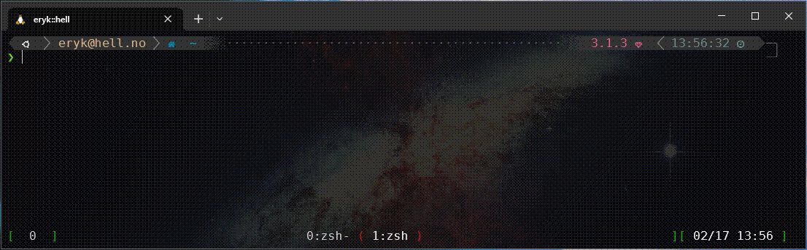
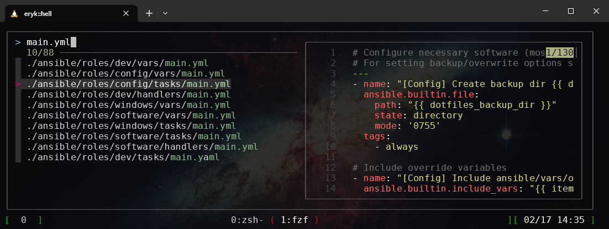
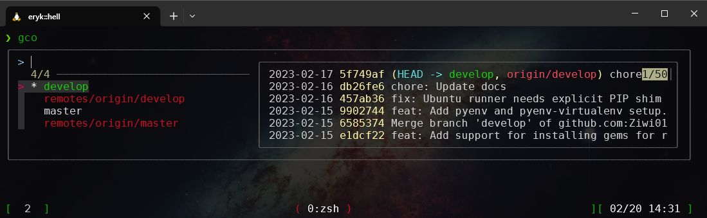
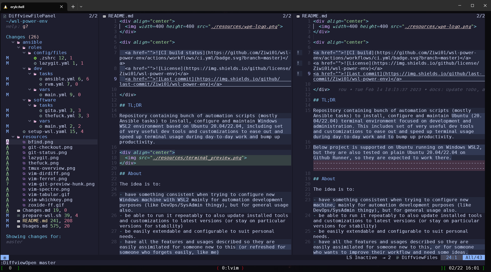

# Usages

This document describes all the tools and features which I find useful for everyday work including usage scenarios and workflows.

## Table of contents

* [Table of contents](#table-of-contents)
* [Terminal](#terminal)
  * [Traverse directories with `Zoxide`](#traverse-directories-with-zoxide)
  * [Find and open files with `fd` and `fzf`](#find-and-open-files-with-fd-and-fzf)
  * [Browse command history](#browse-command-history)
  * [View files with `bat`](#view-files-with-bat)
  * [Better tail](#better-tail)
  * [Correct commands with `thefuck`](#correct-commands-with-thefuck)
  * [Docker/Kubernetes](#docker/kubernetes)
  * [Keychain ssh-agent](#keychain-ssh-agent)
  * [Grep with ripgrep](#grep-with-ripgrep)
  * [List directories/files with git status](#list-directories/files-with-git-status)
  * [Git](#git)
    * [Checkout branches](#checkout-branches)
    * [Status](#status)
    * [Log](#log)
    * [Clone](#clone)
    * [Origin](#origin)
    * [LazyGit](#lazygit)
  * [Languages](#languages)
    * [Python](#python)
    * [Ruby](#ruby)
    * [Java/Gradle/Groovy](#java/gradle/groovy)
* [Tmux](#tmux)
  * [Basic commands](#basic-commands)
  * [Manage sessions](#manage-sessions)
  * [Copy mode](#copy-mode)
  * [Search back buffer](#search-back-buffer)
  * [Extract from buffer](#extract-from-buffer)
  * [Switching panes](#switching-panes)
  * [Synchronize panes](#synchronize-panes)
* [Neovim/LunarVim](#neovim/lunarvim)
  * [Keymappings](#keymappings)
  * [File browser](#file-browser)
  * [Switch buffers around](#switch-buffers-around)
  * [Jump to last opened buffer](#jump-to-last-opened-buffer)
  * [Close opened buffers](#close-opened-buffers)
  * [Diff opened buffer to current file](#diff-opened-buffer-to-current-file)
  * [Diff directories](#diff-directories)
  * [Search and replace](#search-and-replace)
    * [Locally](#locally)
    * [Spectre](#spectre)
    * [Ferret](#ferret)
  * [Open recent file](#open-recent-file)
  * [Find text](#find-text)
  * [Find files](#find-files)
  * [Markdown](#markdown)
    * [Preview](#preview)
    * [Navigation](#navigation)
    * [Table of Contents](#table-of-contents)
  * [Resize/pick splits](#resize/pick-splits)
  * [Align text](#align-text)
  * [Commands with Vimux](#commands-with-vimux)
  * [Plugin management](#plugin-management)
  * [Updates](#updates)
  * [GIT](#git)
    * [Diff current changes](#diff-current-changes)
    * [Diff another branch](#diff-another-branch)
    * [Checkout branch](#checkout-branch)
    * [Git blame](#git-blame)
    * [File history](#file-history)
    * [Reload file after checkout](#reload-file-after-checkout)
    * [Lazygit](#lazygit)

## Terminal

### Traverse directories with `Zoxide`

Uses: [Zoxide](https://github.com/ajeetdsouza/zoxide)

After you've visited any directory (with plain `cd <dir>`, or just `<dir>`) you can easily go back to any directory using `z <pattern>`.

For example:

To go back to `/home/user/projects/ansible`, use something like `z ansible` or `z ans` or similar

`z` will go to first directory matching the pattern. If there are more directories with `ansible` and you want to go to some other one, use `z <pattern> <TAB>`, which will open a fuzzy finder. See example below.

<details>
  <summary><b>Example:</b> Zoxide fuzzy find</summary>
  <div align="center">
    
  </div>
</details>

### Find and open files with `fd` and `fzf`

Uses: 

- [fd](https://github.com/sharkdp/fd)
- [fzf](https://github.com/junegunn/fzf)

Replace your `find` command with that

Easily find files with preview using `bfind` alias (uses `fzf`):

<details>
  <summary><b>Example:</b> Search file with `bfind`</summary>
  <div align="center">
    
  </div>
</details>
</br>

You can scroll the file preview using `SHIFT+up` and `SHIFT+down`

To find files the same way as above and then edit them with VIM, use `vimfind`

To go into a directory using fuzzy search, try `<Alt>+t` or `cd **<TAB>`

### Browse command history

Just use good old `CTRL+R`. You will be presented with fuzzy finder to look for a command.

You can also start typing something and then hit `CTRL+R`, then it will search for the text already put.

### View files with `bat`

`cat` is an alias to `bat` and by default shows line numbers, has syntax highlight and pipes long outputs through a pager.

If you need plain output (for copying purposes for example), use `cat -p <file>`. To also disable paging, use `cat -pp <file>`

See `man bat` if you want more options.

If you want to use old unaliased cat, use `\cat`

### Better tail

There is an alias `btail <file>`, which will use BAT as tail command. This gives better output format and some syntax highlighting.

<details>
  <summary><b>Example:</b> Tail with `btail`</summary>
  <div align="center">
    
  </div>
</details>

### Correct commands with `thefuck`

Uses: [thefuck](https://github.com/nvbn/thefuck)

Misspelling a command is a real pain in the ass. Here comes the solution. When you misspell a command, try hitting `ESC ESC` or just type `fuck` and hit enter.

`thefuck` will try to correct this command for you. This is handy especially in git commands, for example if you want to push new branch to the remote:

<details>
  <summary><b>Example:</b> Correct new branch push with `thefuck`</summary>
  <div align="center">
    
  </div>
</details>

There are lots of rules - see [rules list](https://github.com/nvbn/thefuck/tree/master/thefuck/rules) (you can also add you own rules in `~/.config/thefuck/rules/`)

### Docker/Kubernetes

Docker is installed and available for use. WSL Ubuntu users with sysvinit (default) need to start it with `/etc/init.d/docker start`.

For regular Ubuntu and those who migrated their WSL distro to `systemd` (see [README.md](./README.md#requirements)) docker should be running (confirm with `systemctl status docker`).

For Kubernetes management from CLI there is a [`kubectl`](https://kubernetes.io/docs/reference/kubectl/kubectl/). For GUI management use [`k9s`](https://k9scli.io/) 

To setup a local kubernetes cluster for development purposes you can use [`kind create cluster`](https://kind.sigs.k8s.io/) which will quickly provision new cluster in Docker.

### Keychain ssh-agent

When using SSH keys with a password we can either input the password every time the key is used (pull, push, fetch etc.) or use `ssh-agent` to persist password for this session.

To go further, [`keychain`](https://www.funtoo.org/Funtoo:Keychain) lets you persist the password accross terminal logins until the machine is restarted.

Use:

    eval `keychain --eval --agents ssh <key1> <keyN>`

If you only have `id_rsa`, you can ommit passing key(s). Keychain will prompt you for all the passwords for those keys and will persist them across logins (you still need to run above command on new terminal, but it won't prompt you for password). To always call it, add it to `~/.zshrc`

### Grep with ripgrep

Uses: [ripgrep](https://github.com/BurntSushi/ripgrep)

Instead of `grep`, use `rg`. Its super fast and easy to use.

The search will be recursive by default, can use regex and lots more. See its [GUIDE.md](https://github.com/BurntSushi/ripgrep/blob/master/GUIDE.md) if you need more advanced usage.

### List directories/files with git status

There are two commands to use for this:

`k`: Looks like `ls -la`, but gives indication on which files/directories have beed modified from Git perspective.

<details>
  <summary><b>Example:</b> List files with `k`</summary>
  <div align="center">
    
  </div>
</details>
</br>

`lsg`: Gives simple, yet more verbose information about what changed (both directory-wise and file-wise)

<details>
  <summary><b>Example:</b> List files with `lsg`</summary>
  <div align="center">
    
  </div>
</details>

### Git

Git used from terminal has some tweaks, including aliases, new commands/functions for branch checkout and git status.

For lots of git commands there are aliases. If you use a command which is aliased, the terminal will remind you that you can use an alias instead.

Aliases below are just helpers in case something needs to be done from terminal directly. Personally I don't use them very often, instead I use LazyGit (invoked from Vim) - see [Lazygit](#lazygit).

#### Checkout branches

`gco` - function alias for `git checkout`. Will show a list of available branches in a fuzzy search so you can pick it from the list. You can also use `gco <branch>` to checkout to specific branch without fuzzing :)

<details>
  <summary><b>Example:</b> Checkout new branch</summary>
  <div align="center">
    
  </div>
</details>

#### Status

`gst` - function alias for `git status` - browse through changed files (with preview). From this view you can also stage/unstage files for commit, edit and run a commit.

<details>
  <summary><b>Example:</b> Checking git status</summary>
  <div align="center">
    
  </div>
</details>

#### Log

`glo` - function alias for `git log`. Runs fuzzy search to browse a commit list, with a preview window of this commit on the right side. You can scroll the preview with <Shift+up/down>.

#### Clone

`gcl <remote_url>` - plain alias for `git clone <remote_url>`

#### Origin

- `grrm <origin_name>` - `git remote remove <origin_name>`
- `gra <origin_name> <origin_url>` - `git remote add <origin_name> <origin_url>`
- `grv` - `git remote -v`

#### LazyGit

All above commands and aliases can be run through [`lazygit`](https://github.com/jesseduffield/lazygit) GUI for managing Git. It has lots of features, which makes Git interactions a breeze, even the painful, complicated ones. You can run it from terminal, but most of my usage comes from within Vim - see Vim section below.

<details>
  <summary><b>Example:</b> Lazy Git interface</summary>
  <div align="center">
    
  </div>
</details>

### Languages

#### Python

By default, Python gets installed using [`pyenv`](https://github.com/pyenv/pyenv) manager for mulitple Python versions. It gets pretty recent version (check with `pyenv versions`). All PIP packages, which get installed during ansible run are installed in that default Python environment, so system Python is intact.

You can install new Python versions with `pyenv install <python_version>`. List available versions with `pyenv install -l`.

To change running version:

- for current shell session: `pyenv shell <version>`
- to change default: `pyenv global <version>`
- to change version whenever you are in current directory, use `pyenv local <version>`

#### Ruby

Ruby is managed through [`rvm`](https://github.com/rvm/rvm) (Ruby enVironment Manager). By default, fairly recent version of Ruby is installed (check with `rvm list`).

You can install new Rubies with `rvm install <ruby_version>` (if no version is passed, latest available will be installed), get the list of all available versions with `rvm list known`

To switch used version, run `rvm use <version>`. To make it default for your shell, add `--default` switch.

#### Java/Gradle/Groovy

All those three languages (and more) are managed by [SDKMAN!](https://sdkman.io/) manager.

- list installation candidates: `sdk list` or simply `list`.
- list available versions for candidate: `sdk list <candidate>`. Candidate can be for example: java, groovy, gradle.
- install candidate version: `sdk install <candidate> <version>`
- use particular version: `sdk use <candidate> <version>`
- check currently used candidate version: `sdk current <candidate>`
- to have automatic version change whenever you enter a directory, you need to place there `.sdkmanrc` file. You can do that by running `sdk env init` inside a directory, and it will create `.sdkmanrc` file with current java used. You can add more `key=value` pairs, for each SDK candidate (e.g `groovy=<my_version>` or other)

## Tmux

[Tmux](https://github.com/tmux/tmux) is a terminal multiplexer, which helps working with mulitple terminals, using panes (splits) and windows. Because it is running on top of the terminal itself, there some neat features which will work even during remote sessions (ssh), like buffer text extract (see below).

TMUX prefix is set to `<C-b>` (ctrl+b) - everything after that is a tmux shortcut/command.

### Basic commands

- `tmux new` - start new TMUX session. Tip: Start with this command whenever you start new terminal :)
- `<C-b>?` - help, list all available shortcuts
- `<C-b>c` - new window
- `<C-b>%` - split window vertically
- `<C-b>"` - split window horizontally
- `<C-b><arrows>` - move between panes. *Easier alternative*: `<Alt>+<arrows>` (includes moving between Vim splits)
- `<C-b><C+<arrows>>` - resize panes
- `<C-b>xy` - kill pane
- `<C-b>n` - next window
- `<C-b>l` - last window
- `<C-b>p` - previous window (in order)

<details>
  <summary><b>Example:</b> Tmux window</summary>
  <div align="center">
    
  </div>
</details>

### Manage sessions

Uses: [tmux-resurrect](https://github.com/tmux-plugins/tmux-resurrect)

You can easily save your whole TMUX session (opened windows, splits, Vim instances) using `<C-b><C-s>`.

To restore it, run `<C-b><C-r>`. Vim instances are persistent only until system restart (or WSL shutdown).

### Copy mode

You can enter a copy mode from Tmux buffer using `<C-b><C-]>` - move around with arrow keys. In copy mode you can select text with `<Space>` and copy selected text with `<Enter>`. It will be copied to your clipboard, so you can paste it normally with `<C-v>` or directly from Tmux buffer using `<C-b><C-]>` (that way you can copy something else to the actual clipboard instead).

To select a block of text (vertical selection), before (or after) selecting text with `<Space>` just hit `v`.

### Search back buffer

Uses: [tmux-fuzzback](https://github.com/roosta/tmux-fuzzback)

During Tmux session, it saves a pretty big buffer (max 14k lines) for everything that was printed to terminal.

You can go back somewhere in the buffer with `<C-b><C-f>`, which will pop up a window with fuzzy finder, where you can search for text. After you go back, you can either examine the contents, or copy anything - see copy mode above.

### Extract from buffer

Uses: [extrakto](https://github.com/laktak/extrakto)

There is this awesome plugin, which can directly extract information from Tmux buffer.

Running `<C-b><TAB>` will open a fuzzy search to extract something.

This can be VERY useful, as the buffer includes also remote SSH sessions. It comes in handy to fill out commands, get the IP, hostname, or any other information, which you would need to copy with mouse or write down.

It has three modes (you can change them with `<C-f>`):

- word: will divide the search in a single words
- all: will show common types if found (urls, paths, quotes)
- line: will show the whole line(s)

After selecting what you want to get, you can either directly put it into terminal with `<TAB>` or just copy it to clipboard with `<Enter>`

### Switching panes

By default, you can move around panes with `<C-b><arrows>`. There is a maximum delay for this to work (between hitting <C-b> and arrow key), so after moving to the pane, arrows will work normally after a second (not switching between panes anymore).

**However!** You can use a very handy `<Alt>+<arrows>` (without `<C-b>` prefix) to jump between panes **and** Vim windows/splits.

### Synchronize panes

Sometimes you need to enter the same commands in all you panes (like after logging to two ssh servers, need to run the same things).

You can turn on panes synchronizations with: `<C-b>:` and writing `setw synchronize-panes on`

## Neovim/LunarVim

Uses: [LunarVim](https://www.lunarvim.org/)

Main config file can be found in this repo (`ansible/roles/dev/files/lvim-config.lua`) or `~/.config/lvim/config.lua` on the filesystem.

If you need/want to introduce changes to that file, I recommend creating a new branch locally, changing it on that branch and running ansible again (to only update the config add `--tags lazygit,config`). To get the latest upstream updates, just merge any tag from origin

`vim` is an alias for `lvim` in the terminal.

Inside Vim, the main key (leader key) is `<Space>` - most of the shortucts start with that.

### Keymappings

Uses: [nvim-whichkey](https://github.com/folke/which-key.nvim)

After hitting `<Space>` (or a key from which a keymap starts), the popup will show available keymaps which begin with the key you pressed. You can customize those keybindings, add new, remove etc. - see whichkey docs.

To get the whole list of keymaps you can browse them with `:Telescope keymaps`

### File browser

Uses: [NvimTree](https://github.com/nvim-tree/nvim-tree.lua) 

Toggle file browser with `<Space>e`. The root of the tree will be set to the project of the current file (project is any parent directory with `.git`, `node_modules` etc.).

You can change focus from the tree to file with `<Alt>+<arrows>`.

Useful shortcuts:

- `g?`: open help
- `<Enter>`: go into/open directory, open file
- `<C-]>`: go into directory and make it root.
- `<TAB>`: preview file (open buffer, but don't focus on it. Any other `<TAB>` will use the same buffer)
- `-`: go up the directory tree
- `gtg`: ripgrep for text in selected directory
- `gtf`: search for file in selected directory
- `<Space>f`: search for file in current project
- `v`: Open file in vertical split. Useful to compare two files - open in split, close the tree (`<Space>e`), and compare: `:windo diffthis`

### Switch buffers around

You can switch around opened buffers with `<Shift>H` (left) or `<Shift>L` (right).

Also you can pick the buffer from a fuzzy search with `<Space>bf`. From this view, `<Enter>` will just open the file, but `<Ctrl>+<Shift>+v` will open that buffer in a vertical split.

### Jump to last opened buffer

Use `<C-6>` to jump between last edited place (buffer).

### Close opened buffers

To close the buffer you are in: `<Space>c`.

You can also close all buffers except the one you're in:

- `<Space>bh`: close all buffers to the left
- `<Space>bl`: close all buffers to the right
- `<Space>e`: pick a buffer to close (buffer icons will turn into letters, pick one to close that buffer)

### Diff opened buffer to current file

1. Open a buffer in split:
  1. `<Space>bf`: find buffer
  2. Select buffer, `<Ctrl>+<Shift>+v`: Open in split
2. (if opened) Close NvimTree: `<Space>e`
3. `:windo diffthis`: start diff

To close the diff either close any buffer with `<Space>q`

To only stop the diff: `:diffoff`

In the diff window you can use below to jump around:

- `]c`: jump to next change
- `[c`: jump to previous change

Or apply changes between windows:

- `:diffput`: put this change in adjacent window
- `:diffget`: get this change from adjacent window

Of course, switch focus between windows with `<Alt>+<arrows>`

### Diff directories

Uses [DirDiff](https://github.com/will133/vim-dirdiff)

To diff two directories, ensure you are not in NvimTree window, and run: `:DirDiff <dir1> <dir2>`.

This will open a directory diff window

<details>
  <summary><b>Example:</b> Diff directories</summary>
  <div align="center">
    
  </div>
</details>
</br>

In the DirDiff view you can:

- exclude files with `x`. Useful for example for `.git` pattern. After excluding run `u` to update the diff
- open diff with `<Enter>`
- sync the changes with `s`. The editor will ask you which changes to accept ('A' or 'B')
- to sync multiple files at once, select them with `<Shift>v`, then press `s` to sync.

*TODO*: Integrate DirDiff with Nvim Tree, introduce simple shortcuts/marks for diffing two directories.

### Search and replace

There are couple of methods to do search and replace, each of them has its pros and cons.

#### Locally

Uses: [roobert/search-replace.nvim](https://github.com/roobert/search-replace.nvim)

To replace text locally, run:

`<Space>ro`

It will open a pattern/replace snippet (`:%s/<pattern>/<replacement>/gcI`) 

This will replace every occurence of `<pattern>` in a current file to `<replacement>`. Pattern can be a regex, including groups etc. (Caveat: some characters needs to be escaped in the pattern, like braces)

You can also replace text in a selection:

- select lines of text with `<Shift>v`
- hit `<C-s>`

Thanks to the plugin listed above, the replacement will happen for each occurence at a time, asking you if you want to apply the replacement or not (`y/n/a/q/l`).

To quickly replace the word under a cursor: `<Space>rw`

To see what selections are available under current cursor: `<Space>rs`

You can also run the replacement for all opened buffers: `<Space>rb`

#### Spectre

Uses: [nvim-spectre](https://github.com/nvim-pack/nvim-spectre) 

To replace particular occurences in a whole project, run `:Spectre`.

Inside Spectre, go into input mode (`i`) and type the search string. After going to normal mode (`ESC`) it will search for it.

Each line represents an occurence finding. You can exclude the paticular occurence with `dd` on the object. You can also do it on on the whole file.

To replace, run `<Space>R`.

To see more context of the occurence, you can type `<Space>q`, which send highligted occurences to quickfix window with a preview. Close the quickfix window again with `<Space>q`

To close Spectre, run `:q`.

In the example below, there is a search for 'lazygit' with replacement for `WorkingGIT`, excluding file `ansible/roles/software/vars/main.yml`, and the search findings are opened in a quickfix preview window

<details>
  <summary><b>Example:</b> Spectre search</summary>
  <div align="center">
    
  </div>
</details>

#### Ferret

Uses: [Ferret](https://github.com/wincent/ferret)

This is another search and replace tool. It is easier to use. I use it as a fallback replace engine when Spectre fails (happens sometimes) or when I need to replace occurences in currently opened buffers. See Ferret README for more usages.

Basic flow should be to first search for occurences with `<Space>a`. This will fill up a quickfix window (with preview) of all findings. You can delete any occurence you don't want to replace with `dd`.

After quickfix list is ready, run `<Space>r` to run replacement pattern.

Unlike Spectre, there is no preview of how the replacement wil look like.

<details>
  <summary><b>Example:</b> Ferret search</summary>
  <div align="center">
    
  </div>
</details>
</br>

### Open recent file

From welcome screen, just hit `r`, which will fuzzy list recently open files.

If any buffer you can hit `<Space>sr` to open the same window.

### Find text

To dynamically find text in entire project, run `<Space>st`. This will open a fuzzy window with file list and a preview.

You can also used Spectre/Ferret (see above).

To search for text in particular directory only, open NvimTree (`<Space>e`), select directory and hit `gtg`.

### Find files

To dynamically find files in a project, run `<Space>sf`. This will open a fuzzy search window

To find files in a particular directory, open NvimTree (`<Space>e`), select directory and hit `gtf`

### Markdown

Uses:
 - [markdown-preview](https://github.com/iamcco/markdown-preview.nvim)
 - [vim-markdown](https://github.com/preservim/vim-markdown)

*TODO*: Add better markdown support (LSP, snippets etc.)

#### Preview

This can run a preview in your browser with auto-scroll, synamic refresh and all. See above link for details.

Start preview with `:MarkdownPreview`. Stop with `:MarkdownStop`.

#### Navigation

- `]]`: go to next header. `<Plug>Markdown_MoveToNextHeader`
- `[[`: go to previous header. Contrast with `]h`. `<Plug>Markdown_MoveToPreviousHeader`
- `][`: go to next sibling header if any. `<Plug>Markdown_MoveToNextSiblingHeader`
- `[]`: go to previous sibling header if any. `<Plug>Markdown_MoveToPreviousSiblingHeader`
- `]h`: go to Current header. `<Plug>Markdown_MoveToCurHeader`
- `]u`: go to parent header (Up). `<Plug>Markdown_MoveToParentHeader`

#### Table of Contents

To navigate a markdown file base on table of contents, run `:Toc` to open vertical split. I prefer `:Toch` to open horizontal split. Close the window with `<Space>q` when active. (reminder: navigate between windows with `<Alt><arrows>`)

To automatically generate Toc based on the headers, run `:InsertToc` (bulleted list), or `:InsertNToc` (numbered list). An optional argument can be used to specify how many levels of headers to display in the table of content, e.g., to display up to and including h3, use `:InsertToc 3`

### Resize/pick splits

Navigation through splits is as easy as `<Alt><arrows>`. This includes Tmux panes also (so you can go out of Vim to other Tmux pane basically).

To resize Vim windows, use `<Ctrl>+<arrows>`

### Align text

Uses: [tabular](https://github.com/godlygeek/tabular) 

You can align any text with any character (for example align everything with `=` or `:`).

Simply select the text (probably visually with `<Shift>v`), and run `:Tabularize /<char>`, e.g `:Tabularize /=` (see example below)

<details>
  <summary><b>Example:</b> Tabular align</summary>
  <div align="center">
    
  </div>
</details>

### Commands with Vimux

Uses: [Vimux](https://github.com/preservim/vimux)

Vimux is an integration layer for terminal (runs a terminal in Vim). See basic usage in above link.

I intend to use it for running tests (rspec, linting, custom verifications), integrating it with fzf and adding some useful shortucts for re-running previous commands, run against current file or for current project

*TODO*: finish Vimux integration.

### Plugin management

Uses: [Lazy.nvim](https://github.com/folke/lazy.nvim)

This is a plugin manager, which is used in LunarVim.

Open Lazy window with `:Lazy`. From there you can list, debug, update/sync all the plugins.

It is a good idea to update the plugins from time to time (with `s` or `i` from Lazy window).

Along with plugin updates would be good to run LunarVim updates also (see below)

### Updates

For plugin updates please see above.

The recommended way is to update LunarVim using this repository.

Update everything (all software, config files etc.):

```shell
ansible-playbook -i inventory.yml setup-windows.yml -k
```

Or update lunarvim only:

```shell
ansible-playbook -i inventory.yml setup-windows.yml -k --tags 'lunarvim'
```

Manual updates can be done instead of running ansible:

- `:LvimUpdate`: will update LunarVim core and core plugins
- `:TSUpdateSync`: will update Treesitter parsers

However running ansible script is encouraged.

### GIT

Uses: 

- [tpope/fugitive](https://github.com/tpope/vim-fugitive)
- [kdheepak/lazygit.nvim](https://github.com/kdheepak/lazygit.nvim)
- [sindrets/diffview.nvim](https://github.com/sindrets/diffview.nvim)
- [f-person/git-blame.nvim](https://github.com/f-person/git-blame.nvim)
- [junegunn/gv](https://github.com/junegunn/gv.vim)  

See below git related operations from inside Vim.

#### Diff current changes

To quickly preview current GIT changes, use fugitives `:Gvdiff` or `<Space>gd`. This will open a vertical split with all the local modifications.

On the left hand side (in the gutter column), there are indications if the chunk of code was added/removed/modified (+/-/!). You can preview those changes with `<Space>gp`

See more options by invoking whichkey for git operations: `<Space>g`

Those include:

- checkout branch/commit
- see git blame for this line
- go to next/previous hunk (change)
- reset hunk/buffer
- stage hunk

Diffview opens in separate tab, you can switch the tab(s) with `gt` (next tab) and `gT` (previous tab).

To close it, use `:DiffviewClose` or simply `:tabc`

#### Diff another branch

To open a nice diff between your local and other branch, run `:DiffviewOpen <branch_name>`. You can hit <TAB> before entering branch name so it will list available branches.

In the diffview you can cycle through the diffs or apply a left-hand side for the selection with `X`.

See all options with `g?`

With diffview you can also browse a file history `:DiffviewFileHistory`.

To get changes only for this file, compared to another branch, you can use `:Gvdiff <branch>`

<details>
  <summary><b>Example:</b> Diffview another branch</summary>
  <div align="center">
    
  </div>
</details>

#### Checkout branch

Quickly checkout any branch with `<Space>gb`. Checkout to specific commit with `<Space>gc`. Checkout specific commit for current file with `<Space>gC`

Alternatively you can also checkout with `:G checkout <branch>`

#### Git blame

Basically git blame shows as a 'shadowed' text when you cycle through lines in normal mode.

To see the blame for current line more visibly, you can use `<Space>gl`

To toggle git blame panel for all lines (so you can easily go to specified commit), use `:G blame`

From this view, you can run `g?` to show help of what you can do, like:

- `<Enter>`: close blame and jump to patch that added line
- `o`: jump to patch in horizontal split
- `O`: jump to patch in new tab
- `p`: jump to patch in preview window
- `-`: reblame at commit

#### File history

To get all files history, enter `:DiffviewFileHistory`

To get history for currently opened file: `:DiffviewFileHistory %`

From this view you can:

- `<Enter>`: Open the diff
- `y`: copy the commit hash under the cursor
- `zR`: expand all folds (for all files view)
- `L`: show commit details

Diffview opens in separate tab, you can switch the tab(s) with `gt` (next tab) and `gT` (previous tab).

To close it, use `:DiffviewClose` or simply `:tabc`

Alternatively, you can use `:GV` to browse all commits (`<Enter>` to preview this commit in split). `:GV!` to list only commits affecting current file. Also, you can select lines in visual mode and run `:GV` to show only selected lines changes.

<details>
  <summary><b>Example:</b> File history with Diffview</summary>
  <div align="center">
    
  </div>
</details>
</br>
<details>
  <summary><b>Example:</b> File history with GV</summary>
  <div align="center">
    
  </div>
</details>

#### Reload file after checkout

Sometimes when you have a file opened in a buffer and you checkout to another branch (e.g from lazygit), the file does not get reloaded automatically. There are some indications that changes occured (in left gutter panel in form of `|` sign).

To reload checked out changes, type `:e`.

#### Lazygit

Uses: [Lazygit](https://github.com/jesseduffield/lazygit)

Basically this is a user interface for GIT. It makes complicated things very simple (like cherry-picking commits, interactive rebasing, creating patches, moving commits between branches and much more). Please see its documentation and a video for what it can do really.

Basic usage:

- invoke Lazygit from vim with `<Space>gg`.
- quit it with `q`
- browse through windows (Status/Files/Branches/Commits) with left and right arrows
- browse through tabs in particular window with `[` and `]` (like for branches windows it would cycle through Local Branches, Remotes, Tags)
- whenever you are in any view, hit `x` to get the available shortucts/commands for current context. You can just `<Enter>` to execute them
- (branches view) `<Space>` to checkout branch
- (branches view) `p` to pull, `P` to push, `f` on particular branch to fetch it.
- (files view) `a` to stage all, `<Space>` to stage selected, `c` to commit, `A` to ammend previous commit

Lazygit supports conflicts resolving: when there is a conflict, you can browse through conflicted hunks, `<Enter>` them and select which version you want with up/down arrow keys.

I really suggest to go through Lazygit docs/[tutorial video](https://youtu.be/VDXvbHZYeKY) to get to know this tool. This is basically the only thing I use for git management.

If there is something Lazygit can't do, you can invoke custom command by hitting `:` and running anything (like `git pull <remote> <branch> --no-ff --no-commit` or anything else)

I will try to describe common usages in details here (maybe).
